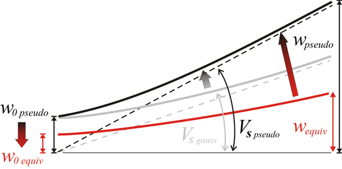

# Calculation of Hyper-Gaussian Beams 

Algorithm for calculation of hyper-Gaussian beams is applied to analyze single-pass systems (SP) when divergence parameter ($M^2$) of input beam is set to a value greater than one. 

## Hyper-Gaussian beam

Hyper-gaussian beam in reZonator is defined as a beam whose divergence is $M^2$ times greater than a Gaussian beam having the same waist radius. Therefore its Rayleigh distance is $M^2$ times less. See also [Beam Parameter Product](#TODO). 

$$ V_{S,hyper} = M^2 V_{S,gauss} $$

$$ w_{0,hyper} = w_{0,gauss} = w_0 $$

$$ z_{0,gauss} = \frac{w_0}{V_{S,gauss}} $$

$$ z_{0,hyper} = \frac{w_0}{V_{S,hyper}} $$

$$  z_{0,hyper} = \frac{w_0}{M^2 V_{S,gauss}} = \frac{z_{0,gauss}}{M^2} $$

## Equivalent Gaussian beam

To describe propagation of hyper-Gaussian beam in free space, it is enough to replace the Rayleigh distance $z_0$ with $z_0 / M^2$ in formulas for $w(z)$ and $R(z)$:

$$ w_{hyper}(z) = w_0 \sqrt{ 1 + \bigg( \frac{z}{z_{0,hyper}} \bigg)^2 }
 = w_0 \sqrt{ 1 + \bigg( \frac{z M^2}{z_{0,gauss}} \bigg)^2 } $$ 

$$ R_{hyper}(z) = z \Bigg[ 1 + \bigg( \frac{z_{0,hyper}}{z} \bigg)^2 \Bigg]
 = z \Bigg[ 1 + \bigg( \frac{z_{0,gauss}}{z M^2} \bigg)^2 \Bigg] $$

It is equivalent to changing of waist size from $w_0$ to $w_0 / M$: 

$$ z_{0,hyper} = \frac{z_{0,gauss}}{M^2} = \frac{\pi w_0^2}{M^2 \lambda} $$

A beam having such reduced waist size is called *Equivalent Gaussian Beam*:

$$ \frac{w_0^2}{M^2} = w_{0,equiv}^2 $$

$$ z_{0,hyper} = \frac{\pi w_{0,equiv}^2}{\lambda} = z_{0,equiv} $$ 

Then we can express waist radis of hyper-Gaussian beam in terms of equivalent Gaussian beam:

$$ w_0 = M \times w_{0,equiv} $$

And substitute it into formulas for $w(z)$ and $R(z)$:

$$ w_{hyper}(z) = M \times w_{0,equiv} \sqrt{ 1 + \bigg( \frac{z}{z_{0,equiv}} \bigg)^2 }
\longrightarrow
w_{equiv}(z) = w_{0,equiv} \sqrt{ 1 + \bigg( \frac{z}{z_{0,equiv}} \bigg)^2 } $$ 

$$ R_{hyper}(z) = z \Bigg[ 1 + \bigg( \frac{z_{0,equiv}}{z} \bigg)^2 \Bigg]
\longrightarrow
R_{equiv}(z) = z \Bigg[ 1 + \bigg( \frac{z_{0,equiv}}{z} \bigg)^2 \Bigg] $$

Since equivalent Gaussian beam has the same Rayleigh distance as hyper-Gaussian beam, its radius is $M$ times less than radius of original beam not only at the waist but anywhere. 

$$ w_{hyper}(z) = M \times w_{equiv}(z) $$

$$ R_{hyper}(z) = R_{equiv}(z) $$

Because equivalent Gaussian beam is a normal Gaussian beam, its complex parameter can be transformed by ray matrices as usual.

## Algorithm of computing

The program uses next algorithm for calculation of propagation of hyper-Gaussian beams: 

1. Equivalent size of input beam is calculated. It is $M$ times less than specified in the dialog of input beam parameters. 

2. Propagation of equivalent Gaussian beam is calculated. 

3. Characteristics of resulting hyper-Gaussian beam are calculated. Its radius is $M$ times greater than radius of equivalent beam and radius of wavefront curvature is equal to that. 

## See also:

[Gaussian Beam](#TODO)

